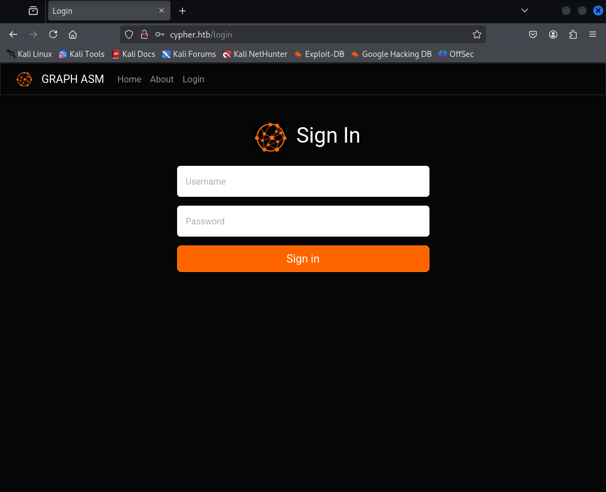
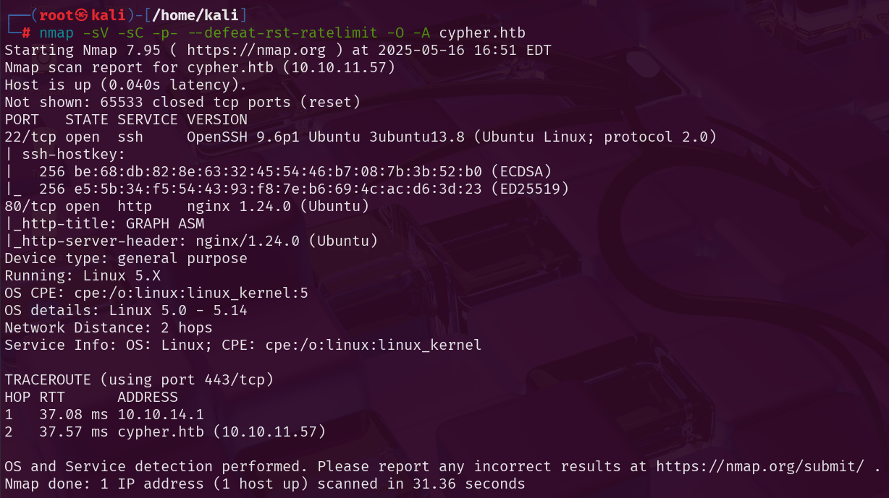

## Step 1: Scan for Open Ports

First thing, let's scan for open ports with the following `nmap` command:

```bash
nmap -sV -sC -p- --defeat-rst-ratelimit -O -A cypher.htb
```
## Scan results:


## Step 2: Investigate website

With only ports 80 and 22 open, we’ll start by examining the web service.



## Step 3: Cypher injection

After trying some Cypher injection payloads we can see that there is a huge error popping up. This strongly suggests a potential Cypher injection vulnerability.



## Step 4: Crafting authentication bypass payload

```bash
{
  "username": "admin' OR 1=1 RETURN 'a94a8fe5ccb19ba61c4c0873d391e987982fbbd3' AS hash //",
  "password": "test"
}
```

This payload returns the hash of the string "test", which is then used for comparison against the user-provided password hash instead of actual admins hash.

# Tip

You can use Burp Suite's proxy to intercept and modify the request, but simply pasting the values directly into the login form fields also works effectively.

