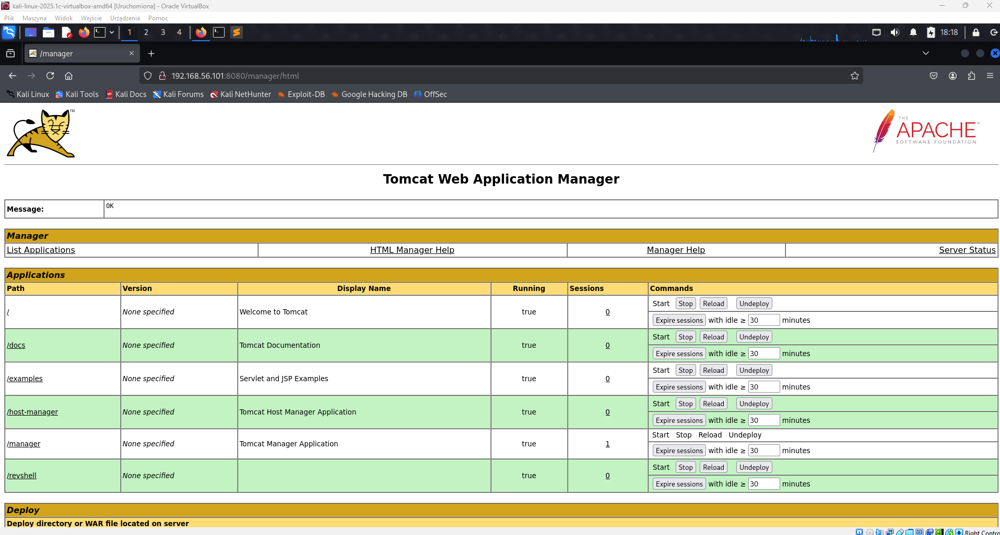
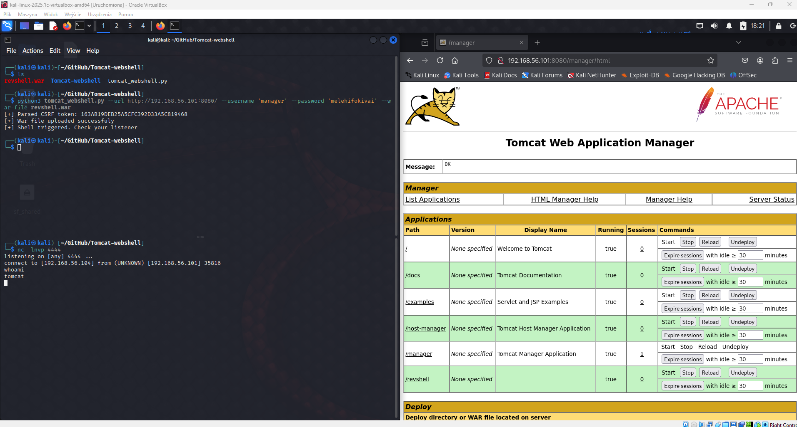

# 🛡️ Penetration Test Writeup — Corrosion 2

## 📝 Summary

This penetration test focused on identifying vulnerabilities on a target system running web services. By leveraging exposed credentials, cracking a protected archive, and exploiting a misconfigured SUID binary, both user and root privileges were successfully obtained.

---

## 🔍 Reconnaissance

- **Target IP:** `192.168.56.101`
- **Open Ports:**
  - `22` — SSH  
  - `80` — Apache HTTP Server 2.4.41  
  - `8080` — Apache Tomcat 9.0.53

---

## 📂 Enumeration & Initial Access

- A backup archive (`/backup.zip`) was discovered via directory busting.
- The archive was password-protected.
- **Password Cracking:**  
  Using **John the Ripper**, the password was cracked: @administrator_hi5
  - The extracted contents included the `tomcat-users.xml` file containing credentials:
- `admin:melehifokivai`
- `manager:melehifokivai`
- These credentials allowed access to the Tomcat Web Application Manager.
- A reverse shell was deployed using the `tomcat` account.

---

## 👤 User Enumeration & Flag Capture

- Discovered users:
- `jaye`
- `randy`
- `tomcat`

- The user flag was found in `randy`'s home directory: ca73a018ae6908a7d0ea5d1c269ba4b6
---

## 🔓 Privilege Escalation

- SSH access to `jaye` was obtained using credentials from earlier steps.
- In `~/FILES`, a suspicious **SUID binary** named `look` was discovered.
- By analyzing and exploiting this binary, root-level access was achieved.

- The root flag was found: 2fdbf8d4f894292361d6c72c8e833a4b
---

## 🔑 Key Takeaways

- **Credential Exposure:** Sensitive information in configuration files can lead to complete system compromise.
- **Weak Archive Protection:** Weak ZIP passwords are easily cracked using tools like John the Ripper.
- **Service Account Misconfiguration:** The `tomcat` user had access to sensitive files.
- **SUID Binary Exploitation:** Misconfigured SUID executables remain a dangerous privilege escalation vector.

---

## 🛡️ Defense Recommendations

- Regularly audit and restrict SUID binaries.
- Enforce strong password policies for archived files.
- Avoid storing plaintext credentials in configuration files.
- Apply the principle of least privilege to service accounts.

---

*✍️ Written by [aut0mateEverything](https://github.com/aut0mateEverything)*

