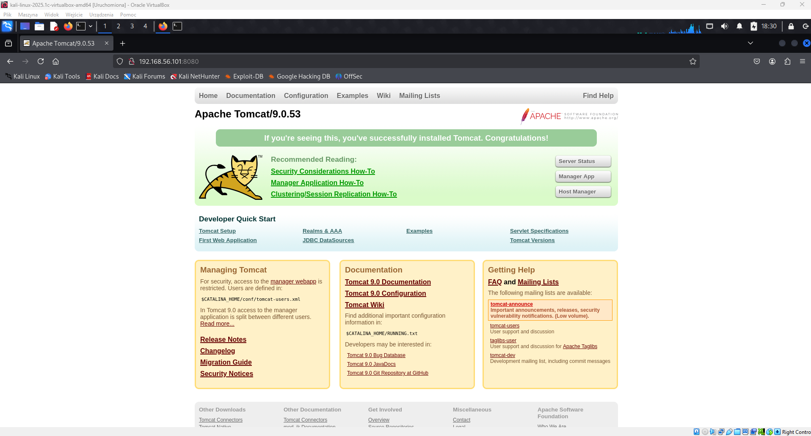

# Penetration Test Writeup — Corrosion 2

## Summary

This penetration test focused on identifying vulnerabilities on the target system running web services. By leveraging exposed credentials and abusing a misconfigured SUID binary, both user and root privileges were successfully obtained.

---

## Reconnaissance

- **Target IP:** `192.168.56.101`
- **Open ports:**
  - `22` — SSH
  - `80` — Apache HTTP Server 2.4.41
  - `8080` — Apache Tomcat 9.0.53

---

## Enumeration & Initial Access

- A backup archive (`/backup.zip`) was discovered through directory busting.
- Sensitive credentials were found inside the Tomcat configuration file `tomcat-users.xml`:
  - `admin:melehifokivai`
  - `manager:melehifokivai`
- These credentials enabled authentication to the Tomcat server, allowing for a reverse shell as the `tomcat` user.

---

## User Enumeration & Flag Capture

- The following users were discovered on the system:
  - `jaye`
  - `randy`
  - `tomcat`
- Accessing `jaye`’s home directory revealed the user flag:

user.txt = ca73a018ae6908a7d0ea5d1c269ba4b6

---

## Privilege Escalation

- With credentials discovered earlier, login to the `jaye` account was achieved.
- Inside `jaye`’s `FILES` directory, an executable named `look` was found with the **SUID** bit set.
- Exploiting this SUID binary allowed escalation to root privileges.
- The root flag was retrieved:

root.txt = 2fdbf8d4f894292361d6c72c8e833a4b

---

## Key Takeaways

- **Credential exposure:** Sensitive information in configuration files can lead to initial footholds.
- **Service account permissions:** Tomcat user had access to sensitive files and system users.
- **SUID binary abuse:** Misconfigured SUID executables remain a critical attack vector for privilege escalation.
- **Defense recommendations:**
- Regularly audit SUID binaries.
- Restrict and rotate credentials for web services.
- Apply least privilege principle for service accounts.

---

*Written by aut0mateEverything — https://github.com/aut0mateEverything*  

